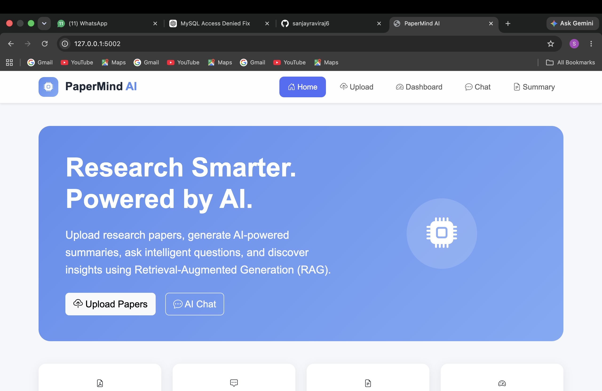
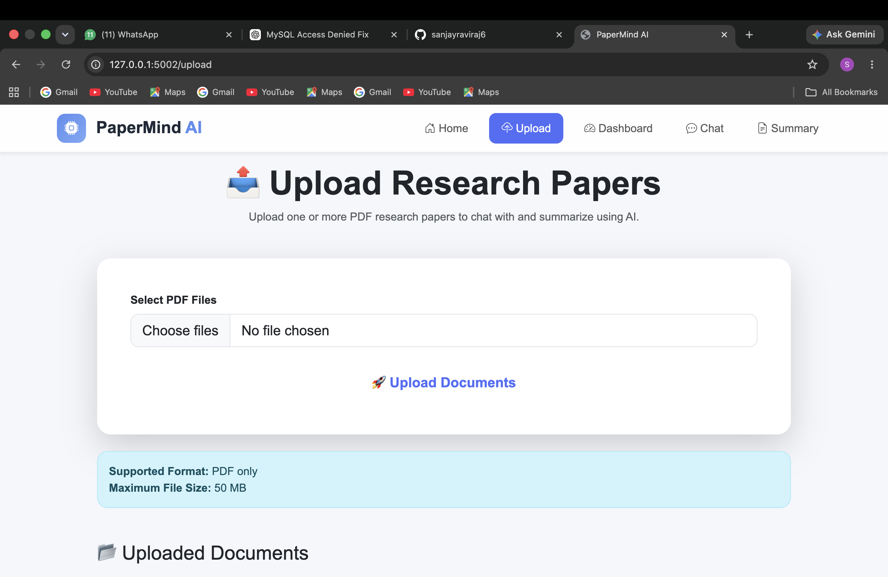
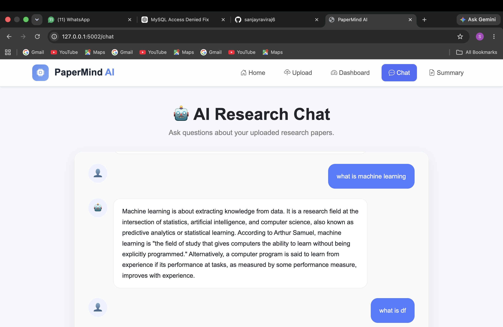
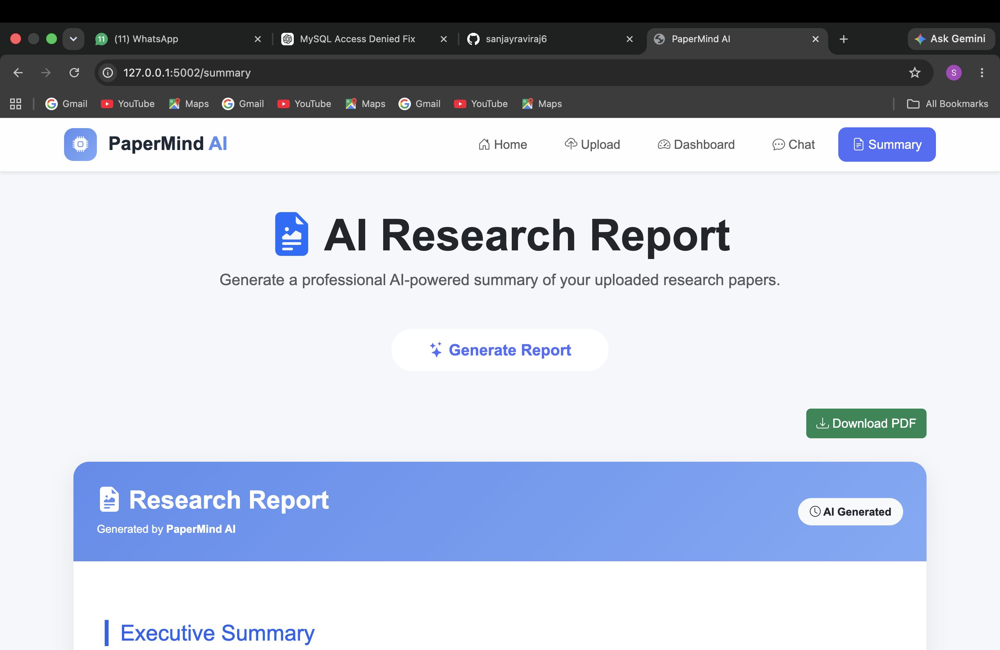
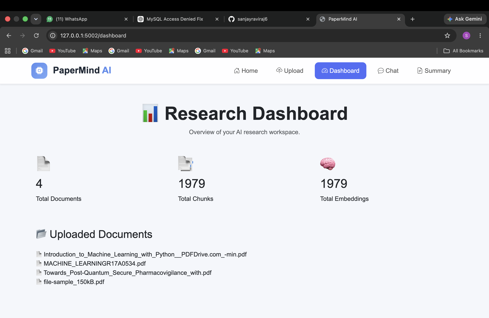

# 📚 PaperMind AI

<p align="center">

AI-Powered Research Assistant built using <b>Flask</b>, <b>ChromaDB</b>, <b>Sentence Transformers</b>, and <b>Groq LLM</b>.

Upload research papers, chat with them using Retrieval-Augmented Generation (RAG), and generate AI-powered summaries.

</p>

---

# 🚀 Features

- 📄 Upload one or multiple PDF research papers
- 🔍 Automatic PDF text extraction
- ✂️ Intelligent text chunking
- 🧠 Generate embeddings using Sentence Transformers
- 🗂 Store embeddings in ChromaDB
- 🤖 Chat with uploaded documents using Groq LLM
- 📝 Generate AI-powered research summaries
- 📊 Interactive dashboard with document statistics
- 🚫 Duplicate document detection
- 🗑 Delete uploaded documents
- 📱 Modern responsive UI

---

# 🏗 System Architecture

```
                PDF Upload
                     │
                     ▼
            PDF Text Extraction
                     │
                     ▼
               Text Chunking
                     │
                     ▼
      SentenceTransformer Embeddings
                     │
                     ▼
                 ChromaDB
                     │
                     ▼
          Similarity Search (RAG)
                     │
                     ▼
               Relevant Chunks
                     │
                     ▼
             Groq Llama 3.3 70B
                     │
                     ▼
              AI Generated Answer
```

---

# 🔄 Workflow

```
User

│

├── Upload PDF

│

▼

Extract Text

│

▼

Split into Chunks

│

▼

Generate Embeddings

│

▼

Store in ChromaDB

│

▼

User asks Question

│

▼

Retrieve Similar Chunks

│

▼

Send Context to Groq LLM

│

▼

Generate AI Response

```

---

# 🛠 Tech Stack

| Category | Technology |
|----------|------------|
| Backend | Flask |
| Frontend | HTML, CSS, Bootstrap 5, JavaScript |
| Programming Language | Python |
| Vector Database | ChromaDB |
| Embedding Model | Sentence Transformers |
| LLM | Groq (Llama 3.3 70B Versatile) |
| Database | SQLite |
| PDF Processing | PyPDF2 |
| ORM | SQLAlchemy |

---

# 📁 Project Structure

```
PaperMind-AI/

├── agents/

├── database/

├── rag/

├── routes/

├── services/

├── static/

├── templates/

├── uploads/

├── chroma_db/

├── app.py

├── config.py

├── requirements.txt

└── README.md
```

---

# ⚙️ Installation

### Clone Repository

```bash
git clone https://github.com/yourusername/PaperMind-AI.git

cd PaperMind-AI
```

### Create Virtual Environment

```bash
python -m venv .venv
```

### Activate

Windows

```bash
.venv\Scripts\activate
```

Mac/Linux

```bash
source .venv/bin/activate
```

### Install Dependencies

```bash
pip install -r requirements.txt
```

### Configure Environment Variables

Create a `.env` file

```
SECRET_KEY=your_secret_key

GROQ_API_KEY=your_groq_api_key
```

### Run

```bash
python app.py
```

---

# 📷 Screenshots

## 🏠 Home

## 🏠 Home

<p align="center">
    
</p>

---

## 📤 Upload

<p align="center">
    
</p>

---

## 🤖 AI Chat

<p align="center">
    
</p>

---

## 📝 AI Summary

<p align="center">
    
</p>

---

## 📊 Dashboard

<p align="center">
    
</p>


---

# 💡 Example Questions

- Summarize this research paper.
- What methodology was used?
- What are the key findings?
- Explain the conclusion.
- Compare the proposed approach with existing work.

---

# 🚀 Future Enhancements

- Multi-user authentication
- Conversation history
- Export chat as PDF
- Multiple LLM support
- Citation highlighting
- OCR support for scanned PDFs
- Cloud deployment
- Dark mode

---

# 👨‍💻 Author

**Sanjay Raj RK**

Computer Science Engineering Student

Singapore PR

AI | Machine Learning | Data Science | Python

GitHub:
https://github.com/sanjayraviraj6

---

# 📄 License

This project is licensed under the MIT License.